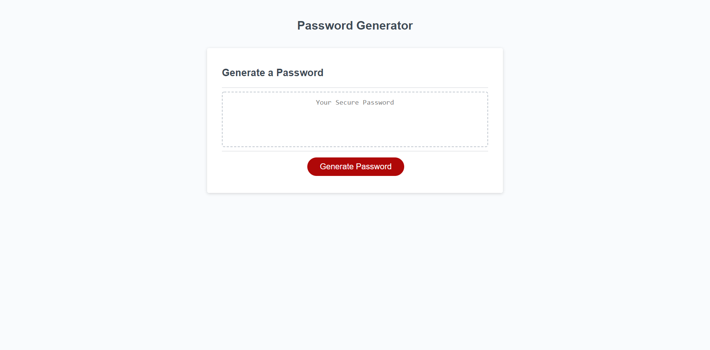

# password-generator

This project is my password generator project for Unit 3 for the UCF bootcamp. One the Generate Password button is pushed,

it will run a series of "if" statements to accept the user's options. For each option confirmed, the accompanying array will

be joined into ane empty array. Once the user options have been selected, another function will run that will run a loop that runs

as many times as the value of what was entered by the user when asked how many characters they wanted to use. Each of these loops 

essentially pull a random character from the empty array that we had added the other arrays into. The resulting string from this loop

returns as the user's new password.

# Screeenshot providing example of of live-link's appearance

## This document is maintained by John Guzzetta

### Github: https://github.com/Guzzemetti

### Github Repository Link: https://github.com/Guzzemetti/password-generator
### Github Project Live-link: https://guzzemetti.github.io/password-generator/

